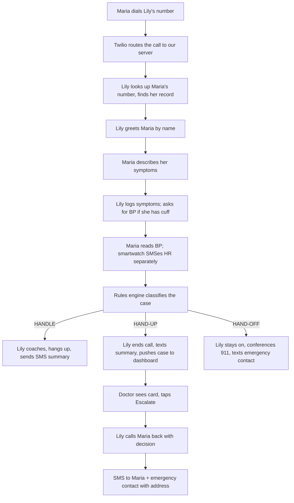

# LILY — Implementation Plan

A plain-English plan for building Lily, the phone-based voice agent for pregnant women in maternity deserts.

---

## 1. The Project (in one page)

**The problem.** In wide stretches of the United States — the Mississippi Delta, the Black Belt, tribal lands, the Rio Grande Valley — there is no obstetrician within reasonable driving distance. A woman with a serious pregnancy complication may be hours away from someone who can help her. This is one of the reasons the U.S. maternal mortality rate is roughly three times that of peer wealthy nations, and why Black women die at nearly three times the rate of white women.

**The product.** Lily is a phone number. A pregnant woman in a maternity desert dials it, on any phone — a flip phone, a phone with no data, a borrowed phone. Lily answers. Lily knows who she is, because Lily has talked to her before. Lily listens to her describe what's happening, gives comfort and education when that's what's needed, and — critically — knows the difference between "you're fine, this is normal" and "this is an emergency and we need to get you help right now." When something is wrong, Lily doesn't just say "call 911." Lily stays on the line, calls the doctor, calls the hospital, calls the patient's emergency contact, and walks her through it.

**The promise.** No app. No internet. No data plan. No English required. Free.

**Where this plan fits.** This document explains what we're going to build, how the pieces fit together, what each piece does, and a focused weekend-build plan for the HackDavis hackathon demo. The two source documents are `lily-abstract.txt` (the thesis) and `lily-implementation-brief.txt` (the detailed spec). This plan operationalizes both.

---

## 2. What a Call Actually Looks Like

Before any architecture, here's what happens when Maria — 32 weeks pregnant in rural Mississippi — picks up her phone and calls Lily.

**Maria dials the Lily number.**

The phone rings once. Lily picks up. Because she recognizes the phone number, she greets Maria by name: *"Hi Maria, this is Lily. I have you here — you're 32 weeks. What's going on?"*

**Maria says: "I have a really bad headache and my hands are puffy."**

Lily already knows Maria has a home blood pressure cuff, because Maria mentioned it three weeks ago. Lily asks: *"Do you have your cuff handy? Can you take a reading? I'll wait."*

**Maria reads her BP.** "148 over 94."

Behind the scenes, Lily writes that down in Maria's record. At the same time, Maria's smartwatch is sending her heart rate to Lily through a separate text message: HR 102. Lily sees both numbers and the symptoms together.

**Lily makes a decision.** Not by guessing — by checking against a deterministic set of medical rules based on ACOG's published Urgent Maternal Warning Signs. The rules say: this BP plus these symptoms is not an emergency, but it does need a doctor's eyes on it. Right now.

**Lily speaks gently:** *"Maria, I want a doctor to take a quick look at this before I tell you what to do. I'll have them review your case and call you back within twenty minutes. Is this number okay?"*

**Lily ends the call** and immediately texts Maria a summary of what they discussed and a backup instruction in case she doesn't hear back.

**On a separate screen,** a volunteer doctor sees a new case appear. It shows Maria's symptoms, her BP reading, her heart rate, and the specific question: *"BP 148/94, headache 2hrs, new edema at 32 weeks, no severe features. Should this go to L&D tonight or same-day tomorrow?"* A timer starts counting down from 20 minutes.

**The doctor taps "Escalate to L&D immediately."**

**Lily calls Maria back.** Same voice. *"Maria, I just heard back from Dr. Chen. She wants you to go to Mercy Regional tonight. I'm texting you the address right now, and I'm texting your sister too. They know you're coming."*

**Maria gets in the car.** Her sister gets a text. The hospital's labor & delivery desk gets a phone call from Lily with a structured handoff. Maria arrives. She is treated for what turns out to be early preeclampsia. She is fine.

This is the entire product. Everything we're building exists to make this five-minute interaction work, work safely, and work for women who do not have an app, do not have internet, and do not have anyone else to call.

---

## 3. The Building Blocks

To make that interaction happen, we need eight components working together. Here they are at a glance. Each is explained in detail in §4.

| # | Component | What it does | Why it exists |
|---|---|---|---|
| 1 | **Phone system (Twilio)** | Receives the call, sends Lily's voice back, sends and receives text messages, can do three-way calls | Lily lives at a phone number. This is what makes the phone number real. |
| 2 | **Speech-to-Text (Deepgram)** | Turns Maria's voice into text, in real time | The AI needs words, not audio |
| 3 | **The Brain (Claude)** | Decides what Lily says next, calls the right tools, writes things down | This is Lily's mind |
| 4 | **Text-to-Speech (ElevenLabs)** | Turns Lily's words into natural-sounding speech | So Lily sounds like a person, not a robot |
| 5 | **The Rules Engine (Python)** | Decides whether a case is routine, needs a doctor, or is an emergency | The Brain talks; the Rules Engine triages. They are kept separate on purpose. |
| 6 | **The Memory (Database)** | Stores everything we know about every patient | "Memory is the product." Without it Lily is just a chatbot. |
| 7 | **The Doctor Dashboard (Web app)** | A single screen where volunteer doctors see cases waiting for review and tap one of three buttons | The "human in the loop" for borderline cases |
| 8 | **The Glue (Server)** | The piece that connects all the others, runs background jobs, and never forgets that a doctor has 20 minutes to respond | Without this, nothing talks to anything |

---

## 4. Each Component Explained

### 4.1 The Phone System — Twilio

**What it is.** Twilio is the telecom company that gives us a real US phone number that any phone can dial. They forward incoming calls to our server, send our server's voice response back to the caller, and handle text messages in both directions. They also let us start outbound calls (to call Maria back) and bridge two phone calls together (to put Lily, Maria, and 911 on a three-way call).

**Why Twilio.** It's the standard. Their tools are mature, the pricing is reasonable, and the documentation is good.

**What we use from them.**
- **Voice** — to receive and place calls.
- **SMS** — to send Maria a summary after every call, and to receive vitals (heart rate, blood pressure) sent from her wearable device or smartphone bridge.
- **Conference** — to do three-way calls when Lily needs to bring 911 or a hospital onto the line.

### 4.2 Speech-to-Text — Deepgram

**What it is.** A service that listens to Maria's voice as she speaks and turns it into text, word by word, with a delay measured in milliseconds.

**Why Deepgram.** Two reasons that matter for us. First, it's fast — among the fastest in the industry — and our entire system has to respond within about 800 milliseconds or the call feels broken. Second, it gives us a confidence score for every word, so when Maria says something critical (like a number for her blood pressure) and Deepgram is unsure, Lily can ask her to repeat it.

**Backup plan.** If Deepgram is unavailable, we fall back to OpenAI's Whisper streaming API. Slower, but reliable.

### 4.3 The Brain — Claude (and the model question)

**What it is.** A large language model that does the actual conversation: deciding what to say, what to ask, when to call a tool, when to log something to memory.

**Today's choice: Claude Sonnet 4.6.** This is the model we use for the hackathon and the early pilot. It has the lowest response latency among top-tier models, the strongest tool-calling reliability, and excellent instruction-following — all things that matter when the AI has to decide quickly whether to log a symptom, call the rules engine, or send an SMS.

**Your question about a "more medically advanced" open-source model.** This deserves a direct answer.

There are several open-source medical language models available right now:

- **OpenBioLLM-70B** (Saama AI, based on Meta's Llama 3) — currently the strongest open-source medical model on standard medical benchmarks.
- **Meditron-70B** (EPFL) — Llama-2-based, fine-tuned on medical literature.
- **Apollo-2** (Hugging Face) — multilingual, good for non-English contexts.
- **Med-PaLM / Med-Gemini** (Google) — these are not open-source and not available to use.

Here is the honest tradeoff. "Medically advanced" sounds like exactly what we want, but for what Lily actually does, it isn't quite right. Lily is not making diagnoses. The rules engine — a deterministic Python file grounded in ACOG guidelines — does the medical decision-making, on purpose, so that every escalation can be audited and defended. What the Brain has to do well is:

1. Talk warmly and naturally to a frightened person.
2. Reliably call the right tools at the right time (log a symptom, log vitals, classify the case).
3. Recognize the line it cannot cross (no diagnoses, no new prescriptions, no dosage adjustments).
4. Be cheap and fast enough to run on every turn of every call.

On all four of those, today's general-purpose models — Claude in particular — beat the open-source medical models. The medical models are trained for question-answering, not for tool-using conversation. They tend to over-confidently produce medical opinions, which is the opposite of what we want from Lily.

**Recommendation.** Use Claude for the Brain. Move to a fine-tuned medical model only if and when we identify a specific bottleneck where Claude's medical reasoning is the limiting factor — and even then, the right pattern is probably to use a medical model as a consultant the rules engine can call, while keeping Claude as the conversational driver. Self-hosting an open-source medical model is also a real operational cost (a 70B model needs serious GPUs), which only makes sense once we know it's earning its keep.

**Door left open.** The plan is structured so that swapping out the Brain is a configuration change, not a rewrite. If a year from now Apollo-3 or Meditron-4 outperforms Claude on tool-calling and medical reasoning together, we can switch.

### 4.4 Text-to-Speech — ElevenLabs

**What it is.** A service that turns Lily's text into a human-sounding voice, in real time.

**Why ElevenLabs.** Same reason as Deepgram: latency. Their "Flash" model starts producing audio within about 150ms of receiving text. They also support voice cloning, so we can pick one voice for Lily and keep it consistent across every call she ever makes — important, because the voice itself is part of how Maria recognizes her.

**Voice direction.** Warm, unhurried, mid-range, accent-neutral but not flat. Not a customer-service voice. Not a meditation-app voice. Closer to a calm nurse you've known for years.

### 4.5 The Rules Engine — a small Python file

**What it is.** A function called `classify_case` that takes a list of symptoms, any vitals we have, and the patient's history, and returns one of three answers: HANDLE (Lily manages it), HAND-UP (a doctor needs to look), or HAND-OFF (this is an emergency, call 911 now).

**Why this is separate from the Brain.** This is the most important design decision in the project. The Brain is good at conversation but is not auditable — no one can read Claude's weights and explain why it did what it did. The rules engine, by contrast, is about 80 lines of Python that any clinician can read in 5 minutes. Every rule cites the ACOG guideline it comes from. When a doctor or a judge or a regulator asks "how do you decide whether to escalate?", we point at this file.

**The rules-engine output is final.** If the rules engine says "this is an emergency," the Brain cannot override it. The call goes to emergency services. This is a deliberate, non-negotiable safety property of the system.

### 4.6 The Memory — a database

**What it is.** A database that stores: every patient's profile, every conversation Lily has ever had with them, every symptom they've reported, every vital sign, every standing order from a doctor, every appointment, every emotional check-in.

**For the hackathon.** SQLite — a single file on disk. Simple, fast, no setup.

**For the pilot and beyond.** PostgreSQL with encryption at rest. The schema doesn't change; just the storage engine.

**What gets stored.**
- **Patients:** name, phone, due date, baby's birthday, language, emergency contact, equipment they have at home.
- **Conversations:** start/end time, what tier the case reached, a 3–5 sentence summary written by Lily at the end of every call, flags for next time.
- **Symptoms log:** every symptom mentioned, with timestamp.
- **Vitals log:** every BP, HR, SpO2 reading, with the source (self-report, smartwatch, BP cuff).
- **Standing orders:** patient-specific protocols a doctor has written ("Maria can use Unisom for nausea").
- **Doctor queue:** cases waiting for a doctor's review, with a 20-minute timer.

**The conversation summary is the trick.** We don't replay every call's transcript on the next call — that would balloon over time. Instead, after every call, Lily writes a 3–5 sentence narrative ("Maria called at 9:47pm with a 2-hour headache and new hand swelling..."). The next call loads the last few of these summaries plus the structured facts. This keeps memory rich but compact.

### 4.7 The Doctor Dashboard — a web app

**What it is.** A web page volunteer doctors keep open during their shift. It shows a list of cases waiting for review. Each case is a card with the patient's first name, gestational stage, vitals, symptoms (with the ACOG warning signs flagged), Lily's tentative recommendation, a specific question, and a countdown timer.

**Three buttons.** That's all the doctor sees: `Approve Lily's recommendation`, `Escalate to L&D immediately`, `Add note and send back to Lily`. The dashboard is designed for 15-second decisions. Anything more complex is a design failure.

**A second small page** lets doctors write standing orders for individual patients during quiet times — "Maria can use B6 + Unisom for nausea." Lily surfaces these to the patient when the situation matches.

### 4.8 The Glue — the server (FastAPI)

**What it is.** The Python application that ties all the other pieces together. It receives Twilio's webhooks (when a call comes in, when a text comes in), opens the streaming connections to Deepgram and ElevenLabs, calls Claude, runs the rules engine, writes to and reads from the database, serves the dashboard's API, and runs the background jobs.

**One critical background job: the timer.** When Lily routes a case to a doctor, a 20-minute clock starts. If 20 minutes pass and no doctor has responded, the system — not Maria — calls Maria back, tells her to go to the ER, texts her the address, and calls ahead to the hospital. This timer must survive a server restart. The implementation is a small separate process (`ticker.py`) that polls the database every 30 seconds and fires when timers expire.

---

## 5. How the Pieces Are Distributed

### Backend (everything that isn't the dashboard)

The backend is a single Python application written with FastAPI. Inside it, the code is organized into modules so each role can work in parallel:

- `voice/` — Twilio webhook handlers, Deepgram and ElevenLabs streaming, the conversation loop.
- `brain/` — the Claude integration, the system prompt, the tool definitions.
- `memory/` — the database schema, read/write functions, the patient context loader.
- `rules/` — `classify_case` and all the rules. No imports from anywhere else in the project — pure Python.
- `dashboard_api/` — the JSON endpoints the dashboard polls.
- `sms/` — patient summaries, emergency contact alerts, vitals ingest.
- `ticker.py` — a separate process that polls the database for expired timers.

Everything but `ticker.py` runs in one server process. `ticker.py` runs as a second process so timers survive restarts.

### Frontend (the doctor dashboard)

A small React application. One page that polls the backend every 5 seconds for new or updated cases, plus a second page for writing standing orders. No login system for the hackathon (one hardcoded "Dr. Chen"); real authentication comes in the pilot.

### Hosting

- **For the hackathon weekend:** ngrok tunnels the local server to a public URL Twilio can reach. The dashboard runs on Fly.io's free tier so it has a stable URL the judges can see.
- **For the pilot:** the whole stack moves to a single small cloud VM with TLS, encrypted database, and a managed Postgres.

---

## 6. Tech Stack Summary

| Layer | Technology |
|---|---|
| Phone & SMS | Twilio Voice + SMS + Conference |
| Speech-to-Text | Deepgram (Whisper as fallback) |
| Brain (LLM) | Claude Sonnet 4.6 today; swappable via config later |
| Text-to-Speech | ElevenLabs Flash |
| Rules Engine | Plain Python (no ML) |
| Database | SQLite for hackathon → PostgreSQL for pilot |
| Backend | Python + FastAPI |
| Frontend | React |
| Hosting | ngrok + Fly.io for hackathon → cloud VM for pilot |

---

## 7. The Hackathon Demo — what we actually build this weekend

This section is the focused, buildable plan for the hackathon. Everything beyond the demo is described briefly in §8 and §9.

### 7.1 The demo's promise

A judge picks up a phone. They dial our number. The agent (Lily) answers and has a real conversation. Based on what the judge says, Lily does one of three things:

1. **Handles it herself** — gives comfort coaching, education, or navigation help, then hangs up and texts a summary.
2. **Routes to a doctor** — tells the caller a doctor will call back within 20 minutes. A case appears on a dashboard. A doctor (one of our teammates) taps a button. Lily calls the caller back with the answer.
3. **Treats it as an emergency** — stays on the line, would conference in 911 (mocked for the demo), and texts the emergency contact.

The 90-second pitch demo specifically shows path #2 — the doctor handoff, end to end.

### 7.2 The minimum demo, end to end

### 7.3 What we build, what we mock

**We build, fully working:**
- The voice loop end-to-end (call in, Lily answers, real conversation, sub-second responses).
- Caller-ID lookup and patient context loading.
- Symptom logging and vitals logging during the call.
- The rules engine, with all 9 test cases passing.
- The doctor dashboard with three real buttons.
- The 20-minute timer (compressed to 60 seconds in demo mode).
- The callback to Maria after the doctor responds.
- SMS summaries to Maria and to her emergency contact.
- The wearable-vitals-via-SMS path (a teammate sends the SMS mid-call to simulate the watch).

**We mock, but show in code:**
- The 911 conference — we dial a teammate's phone instead of 911.
- The hospital call-ahead — a prerecorded SBAR is played to a teammate.
- The volunteer doctor signup — one hardcoded "Dr. Chen" in the database.
- Proactive check-ins — one row pre-seeded in the DB to prove the architecture.

**We cut from the weekend entirely (and call out as next steps in the pitch):**
- Spanish.
- Real wearable Bluetooth pairing.
- HIPAA certification (we say: "designed for, not certified").
- NPPES doctor verification.

### 7.4 Build order — who does what, when

The team of four splits into the four roles from the Brief. The order below is critical: voice loop first, because everything depends on it.

**Hours 0–2 — foundations.**
- Voice Lead: Twilio number live, Deepgram and ElevenLabs hooked up, an "echo" loop where calling the number gets you a voice that repeats what you said.
- Brain Lead: Database schema applied, hardcoded "Maria" record, Claude API working from a CLI test.
- Rules Lead: First version of `rules.py`, three test cases passing.
- Dashboard Lead: React app scaffolded, one hardcoded card visible.

**Hours 2–6 — first end-to-end conversation.**
- Voice Lead: Replace echo with Claude. Latency dashboard showing p50 and p95.
- Brain Lead: System prompt v1. Tools for `get_patient_context`, `log_symptom`, `log_vitals`.
- Rules Lead: All 9 test cases passing. `classify_case` exposed to the Brain as a tool.
- Dashboard Lead: Backend `/api/queue` returning real data.

**Hours 6–12 — triage paths and dashboard.**
- Voice Lead: Outbound calls (for callbacks). Twilio Conference primitive working.
- Brain Lead: Memory enrichment, registration flow, verbal-login matching.
- Rules Lead: Doctor queue table, case packet, the persistent timer (`ticker.py`).
- Dashboard Lead: Three action buttons posting to the backend, standing-order form.

**Hours 12–18 — emergency path and SMS.**
- Voice Lead: Three-way conference dialed to a teammate's phone with a prerecorded mock-911.
- Brain Lead: Standing-order surfacing, end-of-call summary writing.
- Rules Lead: Auto-escalation when timer expires, outbound-call worker.
- Dashboard Lead: Demo patient seeded, demo doctor seeded, demo standing order seeded.

**Hours 18–24 — first end-to-end demo dry run.** The whole team runs the 90-second script together. Bugs are logged. Top three are fixed.

**Hours 24–30 — repeated dry runs and polish.** Latency tuning. Pitch deck (5 slides). README. Backup demo video recorded by the end of this block — in case live network fails on stage.

**Hours 30–36 — final rehearsals, Devpost submission.**

### 7.5 The 90-second demo script (from Brief §8, lightly annotated)

| Time | Beat | What's happening behind the scenes |
|---|---|---|
| 0:00 | Presenter: "Maria is 32 weeks pregnant in rural Mississippi. The nearest OB closed in 2018. She has a 2-hour headache and her hands feel puffy. She calls Lily." | — |
| 0:10 | Maria dials. Lily greets her by name. | Caller-ID lookup hits the seeded "Maria" record. |
| 0:20 | Lily asks what's going on. Maria describes symptoms. | Brain logs each symptom via `log_symptom`. |
| 0:35 | Lily: "Do you have your cuff handy?" Maria: "148 over 94." | `log_vitals` writes the BP. |
| 0:45 | Teammate sends `HR:102` SMS. Lily acknowledges it. | SMS webhook updates session vitals. |
| 0:55 | Lily: "I want a doctor to look at this. They'll call you back within 20 minutes." | Rules engine returned `hand_up`. Case packet written to dashboard. SMS sent to Maria. |
| 1:00 | Presenter turns laptop to judges. Card visible, timer counting down. | Dashboard polled `/api/queue`. |
| 1:10 | Teammate (as Dr. Chen) taps "Escalate to L&D immediately." | Action posted to backend; Lily's outbound-call job queued. |
| 1:20 | Maria's phone rings. Lily: "I just heard back from Dr. Chen. She wants you to go to Mercy Regional tonight. I'm texting you and your sister the address." | Outbound call placed. SMS to Maria and emergency contact. |
| 1:30 | Presenter: "No app. No data plan. Any phone. That was Lily." | — |

### 7.6 Risks for the demo, and what we do about each

| Risk | What we do |
|---|---|
| Voice loop too slow over conference WiFi | Demo on wired ethernet. Have a hotspot ready. Backup video recorded. |
| Twilio call doesn't connect on stage | Backup video. |
| Speech-to-text mishears the BP number | Confidence check — Lily re-asks if unsure. Manual override on the dashboard. |
| Server restart kills timers | Timers persist in the database. We don't restart the server during the demo. |
| Live wearable SMS doesn't arrive | Lily's prompt has a fallback: "I don't see a wearable reading yet — let's go with what you've got." |
| Anthropic API hiccup | Pre-warm the connection. If it fails mid-demo, the latency dashboard will show it and we cut to backup video. |

---

## 8. Beyond the Hackathon (sketch only)

Once the demo proves the concept, the next 6 months focus on a **pilot** with one rural maternal health partner organization. The big workstreams:

- **Real wearables** that work for our demographic: cellular-enabled BP cuffs (Omron, iHealth) that text readings directly to our number — no smartphone needed. Patients receive them through the partner organization.
- **Spanish** — translated by a bilingual perinatal clinician, not Google Translate. Voice cloned in Spanish. Code-switching supported (a patient saying "tengo headache desde las dos").
- **HIPAA preparation** — encrypted database, access logs, BAAs with all vendors, redacted logging.
- **Memory at scale** — instead of replaying call summaries forever, a rolling 200-word patient narrative regenerated weekly, plus structured facts always available.
- **A clinician advisory board** — three perinatal clinicians who review every escalation decision quarterly and have a kill switch. This is the strongest possible answer to "how do you know this won't kill someone."
- **EPDS screening** woven into postpartum check-ins.
- **Real volunteer doctor signups** with NPI verification through the public NPPES registry.

Phase 3 (12–18 months) is full HIPAA certification (HITRUST CSF), multi-tenant database, real E911 integration (which has serious regulatory complexity — needs a healthcare-telecom attorney), and additional languages: Vietnamese, Tagalog, Diné Bizaad, Haitian Kreyòl.

---

## 9. Decisions We Need From You Before Starting

1. **Demo network.** Wired ethernet at the venue, or hotspot? This is the single biggest live-demo risk.
2. **Anthropic + Twilio + Deepgram + ElevenLabs accounts.** Do these exist or do we need to set them up Friday night?
3. **Who plays Dr. Chen on the dashboard during the demo?** Affects whether the dashboard is on a public URL (Fly.io) or local-only.
4. **Backup demo video.** Confirm Role 4 records this by hour 30 even if morale is good.
5. **Pilot partner.** Not blocking the weekend, but starting outreach to one rural maternal health organization now lets us name them in the pitch's "what's next."

---

*References: `lily-abstract.txt`, `lily-implementation-brief.txt`, ACOG Urgent Maternal Warning Signs, HRSA Maternity Care Target Areas.*
